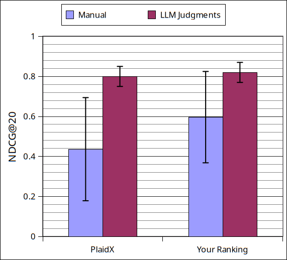

# Prog 5: Experimental Evaluation and LLM-as-a-Judge

In this assignment you will be implementing an evaluation setup from scratch, to evaluate your results from the previous assignment.
You will also compute significance test results, and will develop an alternative qrels file from an LLM-as-a-Judge. 


You are encouraged to ask questions on the discussion forum whenever you are uncertain how to proceed.

**Learning goals**: 
- Implement your own evaluation metric.
- Develop code for statistical testing for significance.
- Obtain automatic relevance labels with LLM-as-a-Judge.
- Complete an experimental evaluation.


You will be building on code and knowledge from the previous assignment. 

    ================================================================================
    Note that if you have not completed the previous assignments, ask one of your 
    team mates to share their rankings with you.
    You can also start with the provided "plaidx" ranking.
    We will refer to either of these as "the ranking"
    ================================================================================


# Task 1. Implement NDCG@20

* Truth file: `./data/neuclir3.qrel`

* PlaidX run file: `./data/plaidx_rankings/neuclir3-plaidx.run`.

* Obtain one additional ranking "run" file from a previous programming assignment.

Parse those files, and implement NDCG@20 (equation in slide deck).

Reminder: First compute NDCG per query, then average the results.


# Task 2: Statistical significance testing

The standard error bar overlap method provides a heuristic to assess significance by comparing the error bars of two ranking means. If the standard error bars do not overlap, this indicates that the difference between the means is statistically significant. However, if the error bars do overlap, it does not necessarily imply no difference. Overlapping error bars can occur because of variance caused by different query samples or populations, meaning one method could still consistently outperform the other. In such cases, a paired t-test is recommended to examine the per-query differences directly and determine significance rigorously. This combination of approaches helps ensure both a quick visual assessment and a more detailed statistical verification.


1. For both rankings, print
   1. (Average) NDCG@20 scores
   2. Variance, standard deviation, and standard error of the per-query NDCG@20 scores
   3. Whether the two rankings are significantly different according to a standard error bar overlap test (and which method is better)

2. Plot the data as a bar chart with error bars (Using average as the value and the standard error for error bars). You can use Excel or plotting libraries such as matplotlib or pandas.

Also see Task 5.


   
# Task 3: Paired T-Test

Familiarize yourself with how to compute a two-sided paired t-test (with threshold alpha=0.05).

You can either use a spreadsheet function `=TTEST($range1,$range2,2,1)` or you can use the `scipy` function `ttest` (<https://docs.scipy.org/doc/scipy/reference/generated/scipy.stats.ttest_rel.html>)

Using the plaidx ranking as the reference, print information whether the other ranking is significantly different according to the paired t-test (and which method is better).


**Example.** To compute a paired t-test you will need per-query evaluation metrics, for example


| Query  | PlaidX NDCG@20    | Your Ranking NDCG@20 |
| -------|--------------------|-----------------------|
| 300    |  0.4               | 0.6                   |
| 303    |  0.01              | 0.2                   |
| 335    |  0.9               | 0.99                  |
|        |                    |                       |
| All    |  0.43              | 0.59                  |

The paired t-test result in this example is 0.0449. 

Since this number is < 0.05 (=alpha), this indicates that the results **are significantly different**.

From the NDCG average across all queries (0.43 vs 0.59), you know that the second method is better.


# Task 4: LLM as-a-Judge

Obtain alternative relevance judgements via an LLM for the top 20 documents of the Plaidx ranking for all three queries. (Start with only three documents until you know your code works reliably.)


## Judgment Prompt
**Use this prompt** to obtain a LLM-based relevance judgements. The prompt is taken from Faggioli, Guglielmo, et al. "Perspectives on large language models for relevance judgment." Proceedings of the 2023 ACM SIGIR international conference on theory of information retrieval. 2023.

```
Instruction: You are an expert assessor making TREC relevance judgments.
You will be given a TREC topic and a portion of a document.
If any part of the document is relevant to the topic, answer "Yes".
If not, answer "No". Remember that the TREC relevance condition
states that a document is relevant to a topic if it contains information
that is helpful in satisfying the user’s information need described by
the topic. A document is judged relevant if it contains information
that is on-topic and of potential value to the user.
Topic: {topic}
Document: {document}
Relevant?
```

Replace 

`{topic}`
: with the title query of the request

`{document}`
: with the document content


## Document Content 
**You can obtain the contents** of these document from the provided jsonl file `neuclir3-retrieved_docs.jsonl`, which contains entries as follows:

```
{
  "query_id": "324",
  "test_collection": "neuclir",
  "run_id": "plaidx",
  "metadata": {
    "collection": "neuclir",
    "queries": "neuclir3-requests.jsonl"
  },
  "ranked_docs": [
    {
      "doc": {
        "id": "31e2247f-9a60-4b6a-bdeb-9b18fbd0f512",
        "text": "2019-09-28 23: 52 [Real-Time News / General Report] Machu Picchu, a famous site in Peru, South America, has recently been claimed by geologists to unravel the mystery of its construction.\nBased on satellite photos and field measurements, Rualdo Menegat, geologist of Machu Picchu, built in the 15th century, stands up above the Andes Mountains. \"The location of Machu Picchu is not a coincidence,\" Menegat said. \"If the foundation is not broken, it is impossible to build such a building on the mountain.\nDue to its unique geographical location and geological structure, the ancient Inca Empire did not need to spend much time and effort on building materials. However, the stone heap in Machu Picchu was very tight. The seams could not be plugged in with a thin credit card.\nNo, no, no, no, no, no, no, no, no, no, no, no, no, no, no, no, no, no, no, no, no.",
        "title": null,
        "url": null,
        "metadata": null,
        "created": null,
        "cc_file": null,
        "time": null,
        "lang": null
      },
      "rank": 1,
      "score": 28.241640090942383
    },
    ...
    
```

You can also get the content from your search engine system.


## Save Relevance Judgments

Store the relevance judgments in the "qrels" file format understood by trec_eval.


The **qrels (Truth)** file lists of document IDs that are relevant for each of the queries. Qrels stands for "query relevance". In general qrels files are also given as a text file, each line follows this pattern:

```
$query_id $iteration $doc_id $relevance
```

Example:

```
myquery  0  doc1234  1 
```

An example qrels file is provided in `./data/neuclir3.qrel`.


In your case "iteration" is always 0. Your relevance judgments are either 0 or 1.


# Task 5. Experimental Evaluation 

Perform a complete experimental evaluation, comparing PlaidX and your selected ranking in terms of NDCG@20, for both the manual judgments along with standard error bars and significance tests. Then repeat this evaluation using your generated LLM Judgements.


## Table

First create a table with evaluation results you obtained:


| **Method Name**  | NDCG@20  manual |+/- Std Err           | NDCG@20 (LLM judge)  | +/- Std Err           |
| :--------------: | ---------------:| :-------------------- | --------------------:|:--------------------- |
| PlaidX           |  (NDCG All)     |+/- (std err)         | (NDCG All)           | +/- (stderr)          |
| Your Ranking     |  (NDCG All)     |+/- (std err) (t-test) | (NDCG All)           | +/- (stderr) (t-test) |


If the paired t-test identifies that "Your Ranking" is significantly better than the reference (here: PlaidX), then mark this with an upward arrow symbol `(^)`. If it is significantly worse then mark it with a downward arrow `(v)`. If no significance could be detected mark it with a question mark `(?)`.  

It is customary to mark the best numbers in bold. If there are methods that are as good as the best numbers (e.g., they are not significantly different according to your test), then they should also be marked in bold.


Example table with made-up numbers:


| **Method Name**  | NDCG@20 (manual) | Stderr     | | NDCG@20 (LLM judge) | Stderr       |
| :--------------: | ----------------:|:---------- |-| -------------------:|:------------ |
| PlaidX           |  0.44            | +/- 0.3    | | **0.8**             | +/- 0.05     |
| Your Ranking     |  **0.59**        | +/- 0.2 (^)| |  **0.82**           | +/- 0.05 (?) |


Additional evaluation measures are added in additional columns. If you create additional relevance judgments, these will also be additional columns (or different tables), as results are not comparable across qrels. 

Additional ranking methods will be added in additional rows I recommend to keep the reference method for testing fixed. There are two ways to select the reference method: This can either be a simple baseline that you want to outperform, or it can be your best method of which you want to show that all other methods are significantly worse.

Additional datasets should be additional row blocks or column blocks or different tables. Results are not comparable across different datasets.


## Plot

Next create a plot, where the y-axis represents an evaluation measure, and different methods are represented as categories on the x-axis. The error bars we use here are symmetric, so the same value for positive and negative direction. 

Note that different methods have different error bar sizes (0.3 vs 0.2). Recent versions of google sheets does not support custom errors bars, but you can use Excel via SharePoint or Gnumeric.

Please see `plot_example.py` for an example how to produce plots with `matplotlib` (an alternative is `pandas`).





Different kinds of ground truth (like manual vs LLM judgements) or different datasets or configurations should be represented as different series.  Different evaluation measures (e.g. NDCG vs MAP) are best represented as different plots, because their numbers are often on vastly different scales. 

When you decide whether to include multiple results into one plot vs different plots, consider the purpose of these plots. You want to make it easy for the reader to draw the right conclusions.  For the most part we want to show that our shiny new method is better than a baseline (e.g. BM25). You want this to be clearly visible in your plots.


## Interpretation

Finally, add a short paragraph summarizing how you interpret the results. Which method is better? Are the results significant?  Do you get the same findings across different evaluation measures, ground truths, datasets, variations, or other conditions?

At the moment this sounds a bit obvious and trivial, but as you add more methods, evaluation measures, and variations this becomes very critical. You don't want the reader to misinterpret your results, instead "take the reader by the hand" and walk them through the numbers.


# Task 6. Exploration

Explore one idea. Here suggestions:

* Compare all retrieval models you developed so far in this course. (You can also trade with your team mates.)

* Include additional evaluation metrics, implemented by you, via trec_eval, or another third party evaluation tool in your evaluation

* Experiment with different prompts for LLM-as-a-judge how are different prompts affecting the evaluation?

* Are your LLM-judgments agreeing with human judgments (given in ./data/neuclir3.qrel)? Quantify this via Jaccard Index.

